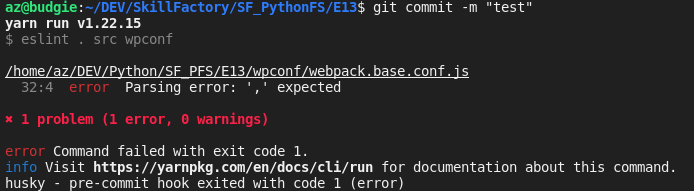
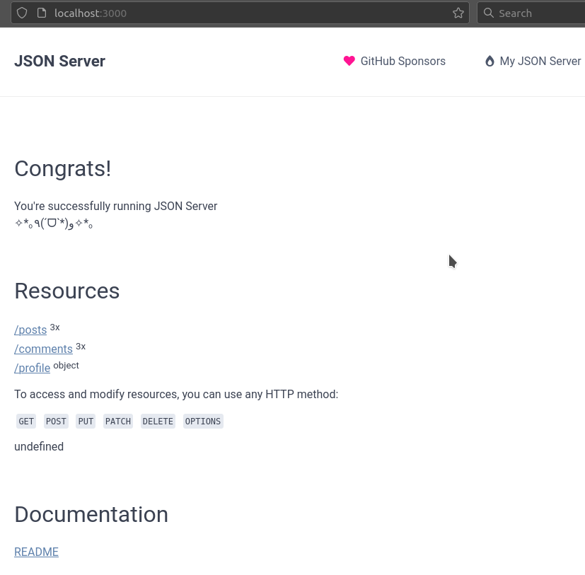

# Модуль E13.7 Практическая работа

В прошлом модуле мы с вами попробовали настроить Webpack. Теперь нужно добавить следующие возможности:

- Установить и настроить _webpack-dev-server_.
- Настроить _hot module replacement_.
- Сделать возможность запуска на разных окружениях (_dev_, _prod_) c разной конфигурацией (например, убрать _HMR_ на проде).
- Настроить _JSON-server_ и отображать полученные с него данные.
- Добавить запуск линтера при комите.

Для запуска json-server надо:

1.  установить json-server командой

    npm install -g json-server

2.  Запускаем json-server:

        yarn dev-json

        или

        npm run dev-json

3.  Открываем браузер и тестируем запрос:

    http://localhost:3000

на выходе должны получить наши данные в json формате.

## Screenshots

